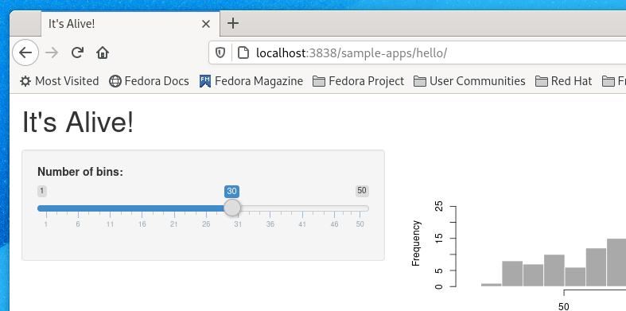
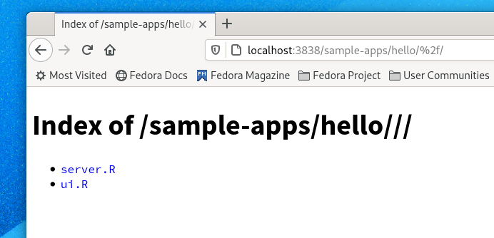
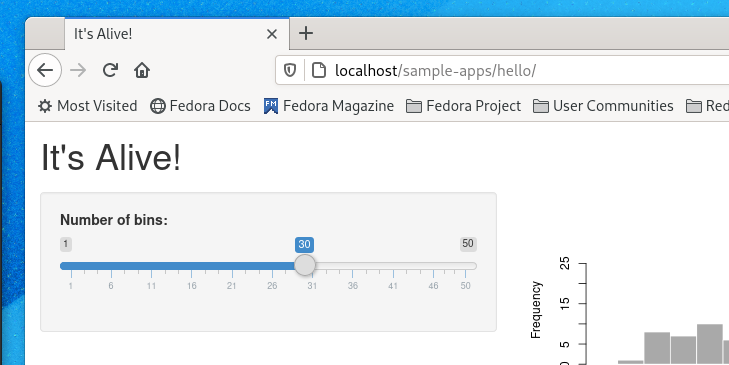
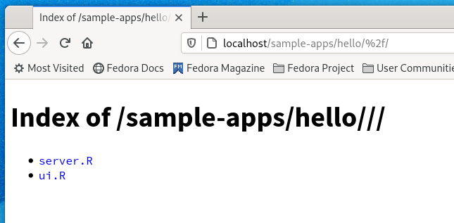

# Rstudio Shiny-Server Directory Traversal and Source Code Leak

Rstudio Shiny-Server prior to 1.5.16 is vulnerable to directory traversal and source code leakage. This can be exploited by appending an encoded slash to the URL. 

## Direct

## Proxied

## References

Security notice from Rstudio https://web.archive.org/web/20210113222412/https://blog.rstudio.com/2021/01/13/shiny-server-1-5-16-update/

Similar vulnerability in Weblogic from 2001 https://web.archive.org/web/20210118180943/https://www.securityfocus.com/bid/2513/info
